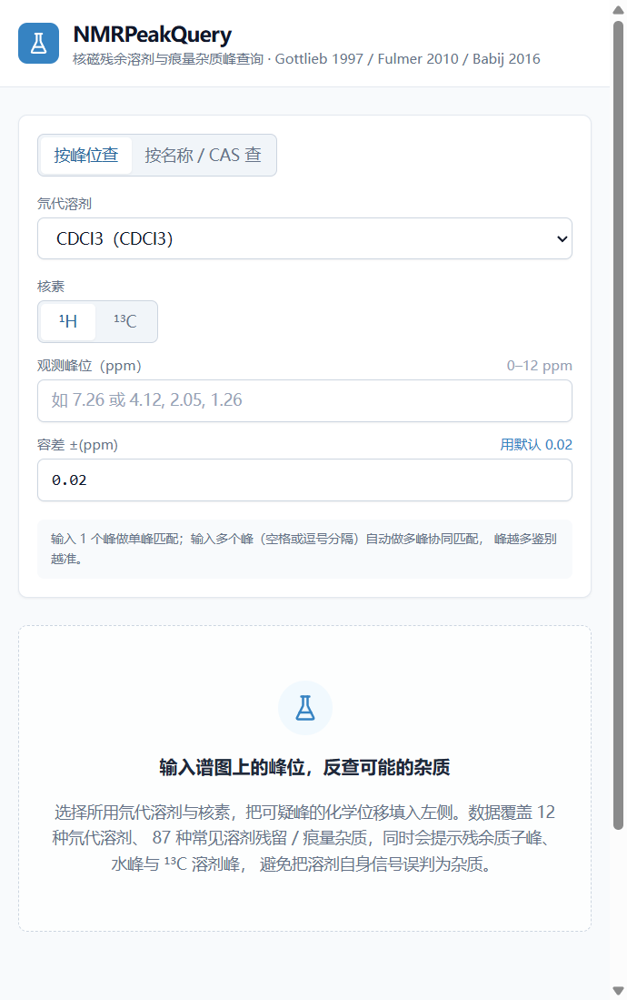
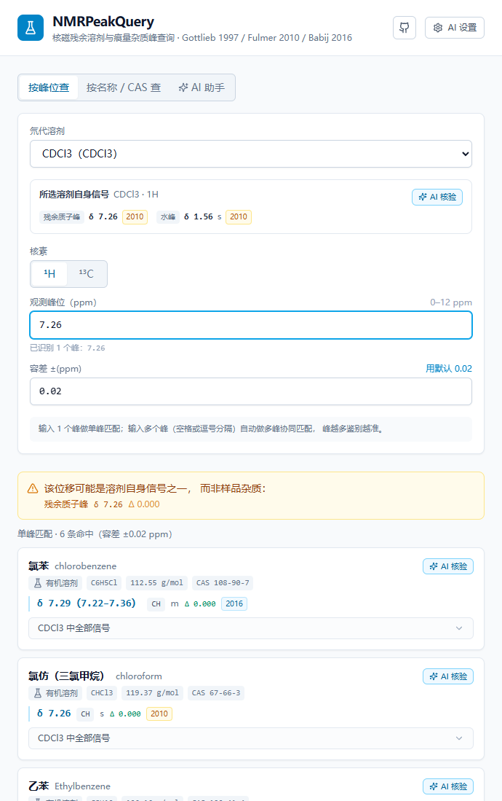
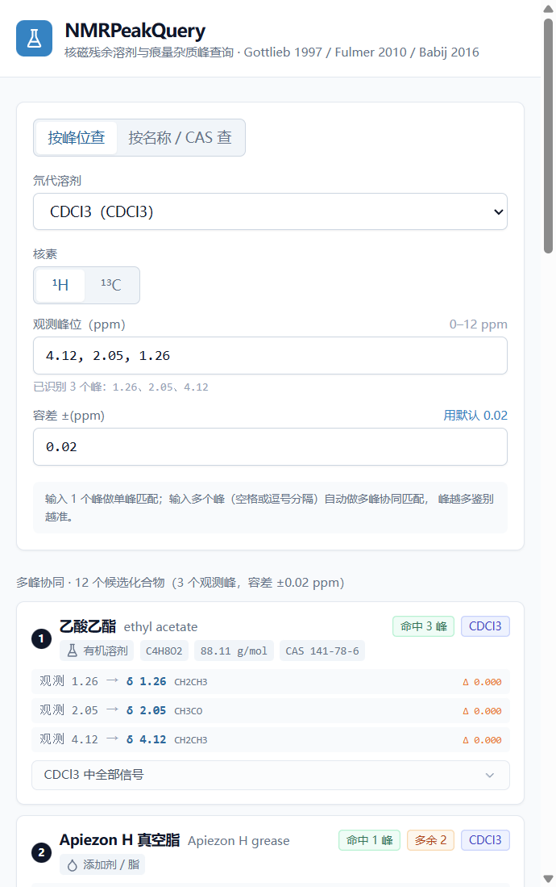
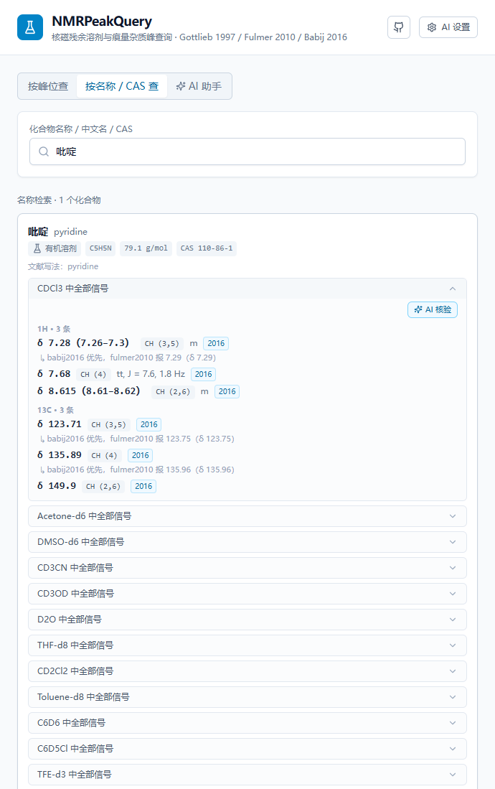
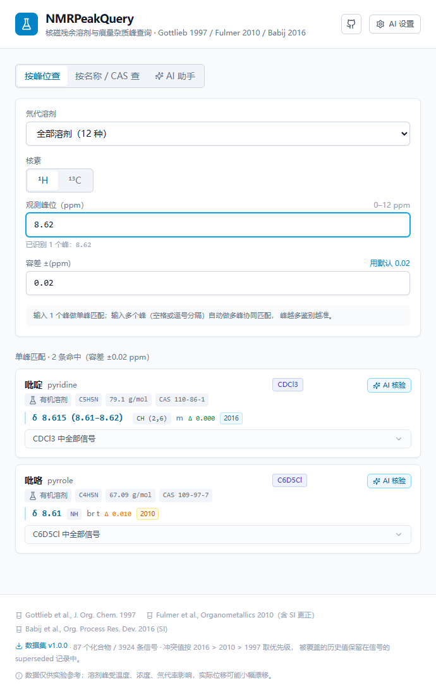
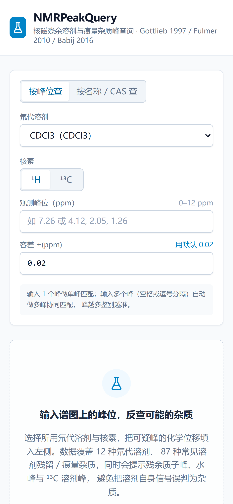
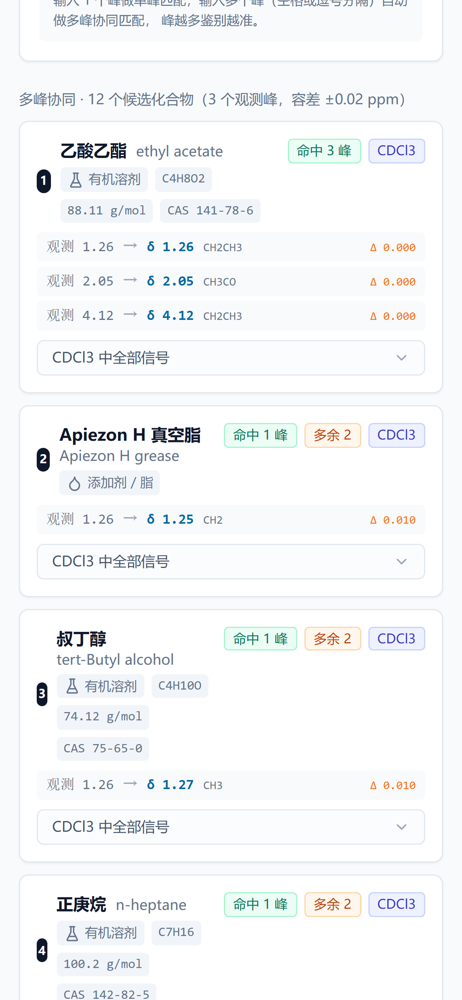

# NMRPeakQuery

> 核磁残余溶剂与痕量杂质峰查询工具 · 基于 Gottlieb (1997) / Fulmer (2010) / Babij (2016) / Cseri (2023) 文献数据

[](LICENSE)

在线使用：**[https://nmrpeakquery-public.pages.dev](https://nmrpeakquery-public.pages.dev)** · AI 助手需自带 Key（见 [AI 助手](#ai-助手)）

[中文文档](#中文文档) · [English](#english)



---

## 中文文档

### 简介

NMRPeakQuery 面向合成化学、有机金属化学及工业分析等场景，用于快速识别核磁谱图中的**残余溶剂峰、水峰与痕量有机杂质峰**。位移匹配与打分全部在浏览器内存中完成，无后端数据库、无网络往返，查询近乎即时。

数据规模：**21 种氘代溶剂 · 153 个化合物 · 8868 条化学位移信号**（其中 12 种溶剂含一级文献化合物数据，另 9 种仅提供溶剂自身峰与物理性质参考值）。

### 功能

- **按峰位查**：输入一个或多个观测化学位移，在指定溶剂与核素下按容差检索匹配化合物，并按偏差排序。默认容差 ¹H ±0.02 ppm、¹³C ±0.2 ppm。
- **多峰协同匹配**：多个观测峰同时参与打分，输出命中 / 缺失 / 多余峰的统计，降低单峰误判。
- **按名称 / CAS 查**：按化合物名称、中文名或 CAS 号检索，并展示跨溶剂位移对比。
- **溶剂自身信号提示**：单峰命中时提示该峰是否只是残余质子峰、水峰或 ¹³C 溶剂峰。
- **化学排版**：分子式、溶剂名与谱峰归属统一渲染为标准上下标（CDCl₃、(CD₃)₂CO、CH₃、¹H / ¹³C）；溶剂选择器以「英文名 · 中文名」呈现。
- **AI 助手（可选）**：数据集核验、实验方法解析（识别氘代溶剂并预测残留溶剂）、谱图核验与归属（谱图图片 + SMILES）。

### 界面预览

| 溶剂自身信号提示 | 多峰协同匹配 |
| :---: | :---: |
|  |  |
| **按名称 / CAS 查** | **跨溶剂对比（全部溶剂）** |
|  |  |

移动端已适配：

| 移动端首页 | 移动端多峰匹配 |
| :---: | :---: |
|  |  |

### 数据来源与合并规则

| 来源 | 载体 | 贡献信号 |
| --- | --- | --- |
| Babij 2016 · *Org. Process Res. Dev.* · [10.1021/acs.oprd.5b00417](https://doi.org/10.1021/acs.oprd.5b00417) | Supporting Information, Tables S1–S12 | 1705 |
| Fulmer 2010 · *Organometallics* · [10.1021/om100106e](https://doi.org/10.1021/om100106e) | Supporting Information, Table S1 / S2 | 2208 |
| Gottlieb 1997 · *J. Org. Chem.* · [10.1021/jo971176v](https://doi.org/10.1021/jo971176v) | Tables 1 / 2 | 11 |
| Cseri 2023 · *ACS Sustainable Chem. Eng.* · [10.1021/acssuschemeng.3c00244](https://doi.org/10.1021/acssuschemeng.3c00244)（补充） | Supporting Information, Part 4 (pp.15–201) | 4944 |
| Sigma-Aldrich 厂商参考表（补充） | [氘代溶剂性质参考表](https://www.sigmaaldrich.cn/CN/en/technical-documents/technical-article/analytical-chemistry/nuclear-magnetic-resonance/nmr-deuterated-solvent-properties-reference) · [杂质化学位移表](https://www.sigmaaldrich.cn/CN/en/technical-documents/technical-article/analytical-chemistry/nuclear-magnetic-resonance/1h-nmr-and-13c-nmr-chemical-shifts-of-impurities-chart) | 溶剂峰参考值（不计入化合物信号统计） |

合并规则：

- 溶剂以 12 个规范 `SolventId` 为主键，各来源的别名经 `normalizeToken()` 归一后映射；
- 化合物**仅在已确认同义组内合并**，不自动推断等价；
- 冲突值优先级 **Babij 2016 > Fulmer 2010 > Gottlieb 1997**（三者同属「常见溶剂痕量位移」表的延续，归属标注规整，互为对照）；被覆盖的旧值保留在 `superseded` 字段；
- **Cseri 2023 仅作补充**：只在旧源未收录的化合物/溶剂组合上提供数据（覆盖 8 种氘代溶剂、大量新兴绿色溶剂/酸/碱）。其归属沿用原文的位次标注（H1/H2…），语义弱于旧源的 CH(2,6) 类归属，故不与旧源争主；
- Fulmer 2010 SI 的 *Corrections and Comments* 修订逐条记录于 `meta.corrections`，保证可追溯；
- **厂商参考表**（Sigma-Aldrich / CIL）单独存放于 `SolventMeta.referenceSignals`，与一级文献值分开——两者口径不同（如 CDCl₃ 残余峰参考表 7.24 vs 文献 7.26），参考值仅展示、不参与合并；其中 9 种溶剂（含 **Pyridine-d5**）仅由此表覆盖。

### 技术栈

React 18 · TypeScript · Vite 5 · Tailwind CSS 3 · Cloudflare Pages + Pages Functions（Wrangler）

### 本地开发

需 Node.js ≥ 18（建议 20 / 22）。

```bash
npm install
npm run dev        # 前端开发服务器，/api 自动代理到 127.0.0.1:8788
```

联调 AI Function 时，另开一个终端：

```bash
npm run build
npm run dev:api    # wrangler pages dev dist --port 8788
```

其他脚本：

| 命令 | 说明 |
| --- | --- |
| `npm run build` | 类型检查 + 构建到 `dist` |
| `npm run preview` | 预览生产构建 |
| `npm run data:extract` | 从文献 PDF 抽取数据 |
| `npm run data:enrich` | 经 PubChem 补充 CAS / 分子式 / 分子量 / SMILES |
| `npm run data:build` | 合并各来源（四个一级文献 + 厂商参考表），生成 `public/data/nmr_data_v1.json` |
| `npm run data:validate` | 校验数据集并输出覆盖统计 |

### 部署到 Cloudflare Pages

支持**同一仓库部署两个 Pages 项目**，用于隔离「含云端 Key 的私有版」与「公开版」：

| 项目 | 环境变量 | 用途 |
| --- | --- | --- |
| 私有版 | 配置 `AI_*` | 自用，云端 Key 仅在此生效 |
| 公开版 | **不配置任何 `AI_*`** | 面向他人，只能自行填 BYOK Key |

两个项目连接同一仓库、构建配置相同；公开版因无环境变量，`/api/ai/status` 恒返回「未配置」、`/api/ai/chat` 直接返回 503，云端 Key 不会被他人调用。

单个项目的部署步骤：

1. 连接本仓库，构建配置：**Build command** `npm run build`、**Build output directory** `dist`；
2. `functions/` 目录会被自动识别为 Pages Functions；
3. 在 **Settings → Variables and Secrets** 配置环境变量（**Production** 环境），修改后需重新部署才生效；**公开版请全部留空**；
4. 在 **Custom domains** 添加自定义域名；公开版可直接使用默认的 `<项目名>.pages.dev`，无需额外 DNS 配置。

### 环境变量

| 变量 | 必填 | 说明 |
| --- | --- | --- |
| `AI_BASE_URL` | 是 | OpenAI 兼容端点，如 `https://api.deepseek.com/v1` |
| `AI_API_KEY` | 是 | 密钥，类型请选 **Secret** |
| `AI_MODEL` | 是 | 文本模型名 |
| `AI_VISION_MODEL` | 否 | 谱图识图模型；不填则禁用图片解析 |
| `AI_MAX_TOKENS` | 否 | 输出 token 上限 |

### AI 助手

两条通道，优先级为 **浏览器自带 Key（BYOK）> 云端配置**：

- **BYOK**：在页面「AI 设置」中填写 Base URL / API Key / 模型，浏览器直连服务商，Key 与请求体不经过部署方服务器（受服务商 CORS 策略约束）；
- **云端配置**：未配置 BYOK 时，走同源 `/api/ai/chat` 代理，Key 仅存放于 Cloudflare 环境变量，永不下发浏览器。

三项能力（核验 / 方法 / 谱图）可独立开关，浏览器端设置优先。所有设置仅保存在本机 `localStorage`，不会上传。

### 目录结构

```
functions/api/ai/   Cloudflare Pages Functions：/api/ai/status、/api/ai/chat
public/data/        数据集 nmr_data_v1.json
public/_headers     静态资源缓存策略
public/_redirects   SPA 回退规则
scripts/            数据抽取 / PubChem 富集 / 合并 / 校验流水线
src/                React 应用（组件、hooks、检索与 AI 逻辑）
```

### 数据出处与免责声明

数据整理自上述四篇文献。结果仅供结构解析辅助参考，**不作为定量依据**，使用前请与原文核对。PubChem 仅用于补充 CAS、分子式、分子量、SMILES 等标识字段。

### 许可

代码以 [MIT](LICENSE) 许可开源。数据集的版权归属四篇原始文献，使用或再分发时请一并引用原文。

---

## English

NMRPeakQuery is a browser-based tool for identifying residual solvent, water, and trace organic impurity peaks in NMR spectra, built on literature data from Gottlieb (1997), Fulmer (2010), Babij (2016), and Cseri (2023).

**Live:** [https://nmrpeakquery-public.pages.dev](https://nmrpeakquery-public.pages.dev) — AI assistant requires your own key (BYOK only).

### Features

- **Peak search** — match observed chemical shifts within tolerance (¹H ±0.02 ppm, ¹³C ±0.2 ppm)
- **Multi-peak cooperative matching** with hit / missing / extra statistics
- **Name / CAS search** with cross-solvent shift comparison
- **Solvent self-signal hints** — residual, water, and ¹³C solvent peaks
- **Chemical typography** — formulas, solvent names, and peak assignments render with proper sub/superscripts (CDCl₃, (CD₃)₂CO, CH₃, ¹H / ¹³C); the solvent selector shows “name · formula” so the formula is never confused with its own brackets
- **Optional AI assistant** — dataset verification, method analysis, and spectrum assignment (image + SMILES)

### Data

21 deuterated solvents (12 with literature compound data, 9 with vendor reference values only) · 153 compounds · 8,868 signals, merged with precedence **Babij 2016 > Fulmer 2010 > Gottlieb 1997**; Cseri 2023 is a supplementary source (fills in compound/solvent combinations not covered by the older sources). Corrections and superseded values are preserved in the dataset for full traceability.

### Tech stack

React 18 · TypeScript · Vite 5 · Tailwind CSS 3 · Cloudflare Pages + Pages Functions (Wrangler)

### Development

Requires Node.js ≥ 18 (20 / 22 recommended).

```bash
npm install
npm run dev        # frontend dev server (/api proxied to 127.0.0.1:8788)
npm run build      # typecheck + build to dist
npm run dev:api    # run Cloudflare Pages Functions locally (after build)
```

### Deployment

Deploy on Cloudflare Pages with build command `npm run build` and output directory `dist`. Set `AI_BASE_URL`, `AI_API_KEY`, and `AI_MODEL` (plus optional `AI_VISION_MODEL`) as **Production** environment variables, then redeploy for changes to take effect.

The same repo can back two Pages projects: a **private** one with `AI_*` set for cloud AI, and a **public** one with no `AI_*` variables so the cloud key can never be used by others (BYOK only). Both share the same build settings.

### License

Code is released under the [MIT License](LICENSE). The dataset is derived from the cited publications — please cite the original papers when reusing it.